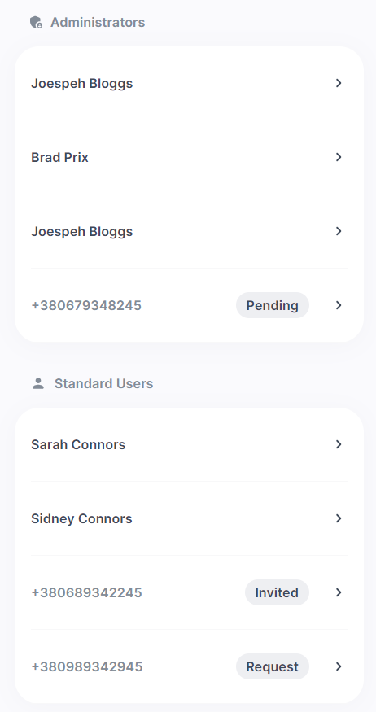

# React Users & Invites

In this task a React Functional component were created where users and invites are rendered.

We needed to show all users and invites together, split into to 2 sections like in this Figma design:

https://www.figma.com/file/r6Y0zKifCDFtLdUh7Lemqi/Untitled?node-id=0%3A1

The only resolution of 375px width for the screen was used.

For api calls were used fake testing data which is in `test-data.ts` file.

Project implemented with Typescript.
Styles are written with plain CSS.

### Result:

